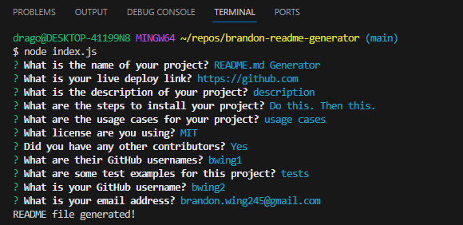

# Brandon README.md Generator

[Video Demonstration](https://youtu.be/Eh-oumU7cEs)

## Table of Contents

- [Description](#description)
- [Installation](#installation)
- [Usage](#usage)
- [License](#license)
- [Questions](#questions)

## Description

As a developer, it is important to have a clear README file for all projects. This not only helps others understand the project better, but also helps when coming back and changing or refactoring code. This project is created using Node.js and the command line. It uses the inquirer package from npm to ask the user questions, and creates a README with the information entered. The questions asked are standard for README files, such as description, installation, usage and more. There is also an option to not include collaborators. This project taught me a lot about how packages work, and how to use data received to create external files.

## Installation

1. Clone the repository from GitHub.
2. Install or have Node.js installed.
3. Open the cloned repository in VSCode.
4. Open the project inside the integrated terminal.
5. Install npm using the `npm` command.
6. Install inquirer version 8.2.4 using the `npm i inquirer@8.2.4` command.

## Usage

1. Use the command `node index.js` in the integrated terminal to run the program.
2. Answer all of the questions with relevant information.
3. The README will be created and be accessible in the project directory.
4. Look over the information to verify that it is correct, and make any additional changes.
5. Save the project, and the README.md is available to use for the desired project.

### Example of terminal

## License

Licensed using MIT

## Questions

- [GitHub Profile](https://github.com/bwing2)

- [Email](brandon.wing245@gmail.com)
